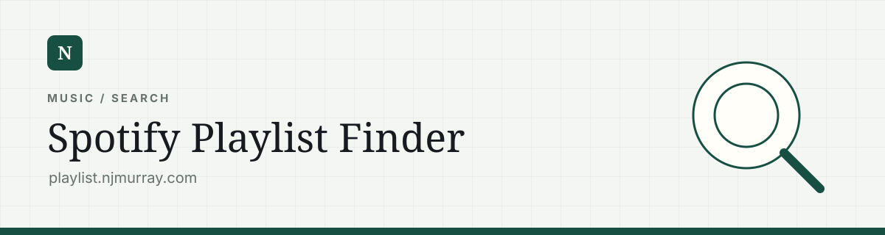
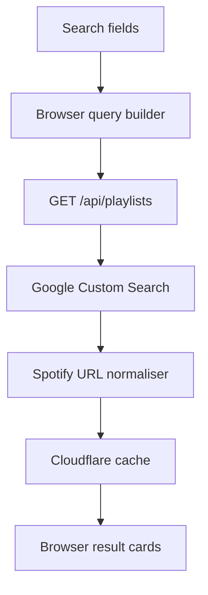

# Spotify Playlist Finder

Search utility at `playlist.njmurray.com` for finding public Spotify playlists that contain a particular combination of artists, tracks, or other terms.

The application is a static browser interface backed by one Cloudflare Pages Function. Google Custom Search performs discovery; Spotify is only the destination of the returned links. There is no Spotify API integration, user authentication, playlist mutation, or database.

## Architecture



The same Spotify-result validation exists on both sides of the request boundary:

- `functions/_lib/spotify.js` filters the upstream Google response before it leaves the server.
- `src/spotify.js` validates the API payload again before it reaches the DOM.

This duplication is intentional. The endpoint guarantees a clean response, while the browser remains safe if the endpoint or payload shape changes later.

## Search lifecycle

### 1. Input construction

`src/main.js` creates eight text fields at runtime from the `placeholders` array. Empty fields are discarded and the remaining values are passed to `buildQuery()`.

Each term is trimmed, wrapped in double quotes, and joined with a space:

```text
Jamie xx + Starburster
→ "Jamie xx" "Starburster"
```

Quoting asks Google to find the supplied strings together rather than treating every word as an independent loose term. Embedded quote characters are escaped before the query is assembled.

### 2. Browser request

The browser sends:

```http
GET /api/playlists?q=%22Jamie+xx%22+%22Starburster%22&limit=10
Accept: application/json
```

The API base comes from `data-api-base` on the document body and defaults to `/api`. Search state is held only in memory:

- `lastResults` stores the most recent valid result set.
- `lastQuery` stores the quoted query shown in the result summary.
- `lastTotal` stores the server-reported count.
- `activeSearchId` prevents a slower old request from replacing the results of a newer search.
- `excludeRadio` controls a local title filter and is not persisted between page loads.

While a request is active, the form receives `aria-busy`, the submit button is disabled, and its text changes to `Searching`.

### 3. API validation and limits

`functions/api/playlists.js` handles `GET` and `OPTIONS`.

The function:

1. requires a non-empty `q` parameter;
2. clamps `limit` to `1–10`;
3. clamps `pageSize` to `1–10`;
4. clamps `pages` to one page;
5. verifies that `GOOGLE_API_KEY` and `GOOGLE_CSE_ID` exist;
6. checks Cloudflare’s default cache;
7. calls Google only when no cached response exists.

The pagination code is retained, but `MAX_PAGES = 1` currently makes every search a single Google request. This caps latency, quota usage, and the result set at ten.

### 4. Google query variants

The API first searches the query exactly as received. If the query includes:

```text
site:open.spotify.com
inurl:playlist
```

a second variant is prepared with those operators removed. The fallback is used only if the first variant produces no valid Spotify playlist URLs.

The Google Programmable Search Engine determines the searchable web index. The repository contains the CSE identifier but not the search-engine configuration itself.

### 5. Result normalisation

Google results are reduced to:

```json
{
  "title": "Result title",
  "url": "https://open.spotify.com/playlist/...",
  "snippet": "Search-result description"
}
```

`onlyPlaylistResults()` then applies the following rules:

1. Accept several possible input URL fields: `url`, `link`, `href`, or `playlist_url`.
2. Unwrap Google redirect URLs by checking their `url`, `q`, and `u` parameters.
3. Require the exact hostname `open.spotify.com`.
4. Convert `/embed/playlist/...` into `/playlist/...`.
5. Remove a trailing slash from the path.
6. Reject Spotify URLs whose path is not `/playlist` or `/playlist/...`.
7. Strip query parameters from the final URL.
8. De-duplicate by the resulting canonical URL.
9. Fall back to the URL as the title if the upstream result has no usable title.

The browser applies the same normalisation once more, truncates to ten results, and optionally removes results whose title contains `radio` case-insensitively.

### 6. Rendering

Each result is cloned from `#result-template` in `index.html`. Titles and snippets are assigned through `textContent`, while the validated canonical Spotify URL becomes the anchor `href`.

Results open in a new tab with `noopener noreferrer`. Empty, filtered-empty, API-error, and malformed-response states all reuse the same empty-state panel with different messages.

## API contract

| Input | Behaviour |
| --- | --- |
| `q` | Required search string. Whitespace is normalised before use. |
| `limit` | Optional result count, clamped to `1–10`; default `10`. |
| `pageSize` | Optional Google page size, clamped to `1–10`; default `10`. |
| `pages` | Present for future expansion but currently clamped to `1`. |

Successful response:

```json
{
  "results": [
    {
      "title": "Playlist title",
      "url": "https://open.spotify.com/playlist/example",
      "snippet": "Google result snippet"
    }
  ],
  "total": 1,
  "limit": 10
}
```

Expected error responses include a missing query (`400`), missing server credentials (`500`), Google quota/access denial (`403`), and Google rate limiting (`429`). A network failure or an unhandled non-success Google status currently degrades to an empty successful result rather than exposing the upstream error.

## Cache behaviour

Successful search responses are stored in `caches.default` for 12 hours.

The cache key contains only:

- the endpoint origin and path;
- the query after removing the two supported Spotify operators; and
- the effective result limit.

This means operator and non-operator versions of the same logical search share a cache entry. `pageSize` and `pages` are not part of the key because the current limits make them implementation details rather than meaningful result variants.

If the Cache API is unavailable, `getCache()` returns `undefined` and the request still works without caching.

## CORS and credential boundary

Requests with no `Origin` header receive `Access-Control-Allow-Origin: *`. Browser requests with an origin receive permission only when the origin appears in `ALLOWED_ORIGINS`.

The allowed set currently covers:

- the main domain;
- the `www` domain;
- the playlist-finder subdomain;
- the two local development origins.

`GOOGLE_API_KEY` and `GOOGLE_CSE_ID` are read only inside the Pages Function. They are never included in the static JavaScript bundle or returned to the browser.

## File map

| File | Responsibility |
| --- | --- |
| `index.html` | Page structure, navigation, form shell, result template, empty state, and API-base setting. |
| `styles.css` | Layout, responsive behaviour, form states, result cards, and visual tokens. |
| `src/main.js` | Input generation, browser state, request lifecycle, filtering, error handling, and DOM rendering. |
| `src/spotify.js` | Browser-side query construction and Spotify URL validation. |
| `functions/api/playlists.js` | HTTP endpoint, parameter limits, CORS, Google request, cache policy, and response shaping. |
| `functions/_lib/spotify.js` | Server-side canonicalisation, validation, and de-duplication. |
| `wrangler.toml` | Cloudflare Pages output and compatibility configuration. |

## Change map

| Change | Main location |
| --- | --- |
| Search-field examples or field count | `placeholders` and `renderInputs()` in `src/main.js` |
| Maximum displayed results | `RESULT_LIMIT` in `src/main.js` and matching limit constants in the API function |
| Result filtering | `applyFilters()` in `src/main.js` |
| Valid Spotify URL rules | Both copies of `spotify.js` |
| Search retry behaviour | `buildQueryVariants()` in `functions/api/playlists.js` |
| Cache duration or identity | `CACHE_TTL_SECONDS` and `buildCacheKey()` |
| Permitted browser origins | `ALLOWED_ORIGINS` |
| Endpoint location | `data-api-base` in `index.html` |

## Current constraints

- Discovery quality depends on Google’s index and the external CSE configuration.
- Only the first ten Google results are examined.
- Spotify playlist metadata is not fetched or verified directly.
- The app cannot distinguish public playlists that have become inaccessible until Google stops returning them.
- Search settings and results disappear on refresh.
- The browser and function copies of the Spotify utility must remain behaviourally aligned when URL rules change.
